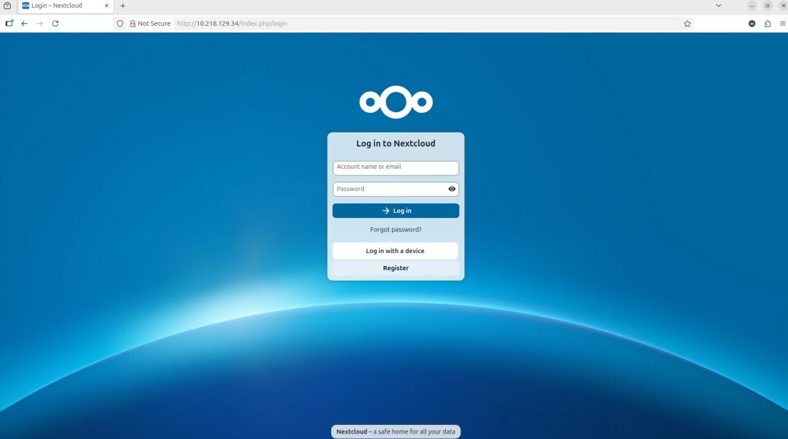

<h1 align="center">🌐 Nextcloud Server Connectivity Test</h1>

<p align="center">
  <b>A simple PowerShell script to monitor the network and web availability of a Nextcloud server.</b><br><br>
  
  
  
  
</p>

---

## 🚀 Overview

This PowerShell script continuously checks the **network reachability** and **web response** of a Nextcloud server.  
It’s perfect for quick diagnostics or uptime monitoring within your local or private cloud setup.

---

## ⚙️ Features

- ✅ **Ping Test:** Verifies if the server is reachable on the network.  
- 🌐 **Web Response Check:** Tests if the Nextcloud web interface responds (HTTP 200).  
- 🧩 **Color-Coded Output:** Easy-to-read console messages (Green = OK, Yellow = Warning, Red = Error).  
- 🔁 **Simple & Lightweight:** Ideal for administrators, IT students, and self-hosters.  

---

## 💻 How to Use

1. Clone the repository:
   ```bash
   git clone https://github.com/KL2400040448/NextcloudMonitor.git
   cd NextcloudMonitor
## 🖼️ Nextcloud Login Portal

Below is a screenshot of the actual Nextcloud instance used for testing:



